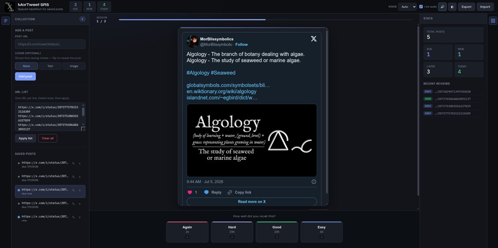
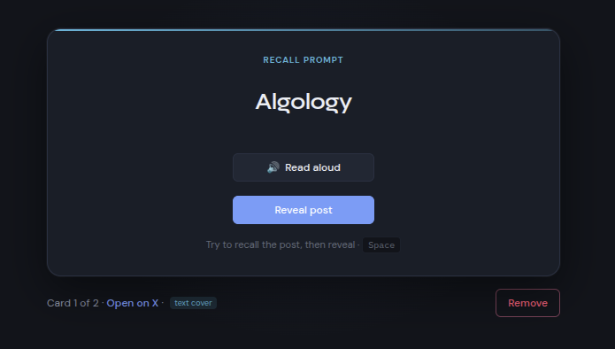
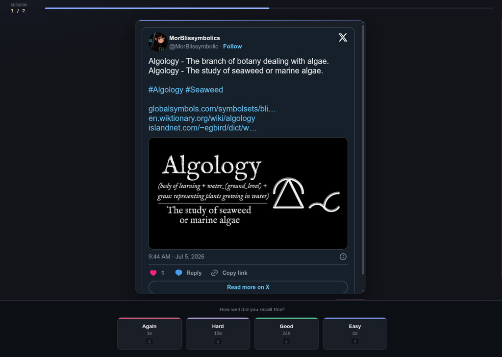
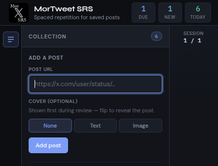
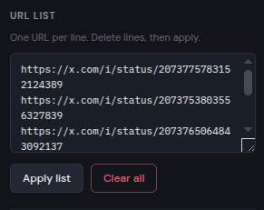

# MorTweet SRS

Spaced repetition for a collection of Twitter/X post URLs. Review posts on an Anki-style schedule with optional **flip-card covers** (text or image) shown before you reveal the tweet.

[](LICENSE)

**Try the web app:** https://moribundmurdoch.github.io/MorTweetSRS/

## Screenshots

### Study workspace

Collection panel, review card, stats, and SRS grading in one view.



### Text cover (recall prompt)

A short prompt is shown first. Use **Read aloud** for TTS, or attach a custom audio link when editing the cover.



### Image cover

Memes, diagrams, or any image work as a cover — same flip-to-reveal flow.


### Revealed post + grading

After you recall the cover, reveal the embedded X post and rate it **Again / Hard / Good / Easy**.



### Add a post

Paste an X post URL and pick a cover type: **None**, **Text**, or **Image**. Text covers support an optional audio link field.



### Bulk URL list

Manage your whole collection as one URL per line.



### All caught up

When nothing is due, the session ends until the next interval.


### Header controls

Due / New / Today counts, voice engine, linked-audio toggle, auto-speak, and export/import.


## Repository layout

| Path | What it is |
|------|------------|
| [`web/`](web/) | Static web app — host anywhere or open via a local server |
| [`desktop/`](desktop/) | Dioxus 0.7 desktop shell (wraps the same `web/` UI) |

Both targets share the same JavaScript app in `web/`. The desktop build copies `web/` into `desktop/assets/app/` at compile time and embeds it in the binary (served via a `mortweet://` custom protocol inside an iframe).

## Web app

Twitter embeds need a real HTTP origin (not `file://`):

```bash
cd web
python serve.py
```

Open http://localhost:8787

`serve.py` serves the app and exposes a local `spd-say` API for Piper TTS on Arch Linux. Plain `python -m http.server` works too, but without local Piper integration.

The web app is also deployed to **GitHub Pages** on every push to `main`.

### Features

- Add posts individually or in bulk
- Optional **cover** per post (text or image) — recall prompt before reveal
- Optional **audio link** per text cover (direct `.mp3`/`.wav` or YouTube)
- Free TTS: auto-speak, online fallback, Piper/spd-say on Linux
- Edit covers later via **✎** on any saved post
- **Again / Hard / Good / Easy** grading (`1`–`4`)
- `localStorage` persistence + JSON export/import

**Desktop packages:** see [Releases](https://github.com/MoribundMurdoch/MorTweetSRS/releases/latest) for `.deb`, `.rpm`, and Arch builds.

## Desktop app

Requires [Rust](https://rustup.rs/) and [Dioxus CLI](https://dioxuslabs.com/learn/0.7/getting_started):

```bash
cargo install dioxus-cli --locked
```

### Run in development

From the repo root:

```bash
cargo run
# or, with hot reload:
./run-desktop.sh
```

`dx serve` must run from the repo root (workspace `Cargo.toml`):

```bash
dx serve --platform desktop
```

### Release build

```bash
cargo build --release
```

Binary: `target/release/mor_tweet_srs_desktop`

### Linux packages

Build Debian, Fedora/RHEL, and Arch packages from the repo root:

```bash
./packaging/build-packages.sh
```

Artifacts land in `packaging/dist/`:

| Distro | Package | Install |
|--------|---------|---------|
| Debian / Ubuntu | `mor-tweet-srs-desktop_0.1.0_amd64.deb` | `sudo dpkg -i mor-tweet-srs-desktop_*.deb` |
| Fedora / RHEL | `mor_tweet_srs_desktop-0.1.0-1.x86_64.rpm` | `sudo dnf install ./mor_tweet_srs_desktop-*.rpm` |
| Arch Linux | `mor-tweet-srs-0.1.0-1-x86_64.pkg.tar.zst` | `sudo pacman -U mor-tweet-srs-*.pkg.tar.zst` |

Individual builds:

```bash
dx bundle --platform desktop --package-types deb   # .deb
dx bundle --platform desktop --package-types rpm   # .rpm
cd packaging/arch && makepkg -f                    # Arch
```

The `.deb` and `.rpm` from `dx bundle` are self-contained fat binaries (~50 MB). The Arch package links against system WebKit/GTK (~3 MB).

## License

**MIT** — see [LICENSE](LICENSE). This is the most permissive license practical for this project:

- All app source here is original MIT-licensed code
- Runtime use of [Twitter/X embed widgets](https://developer.twitter.com/en/docs/twitter-for-websites) is subject to X's terms when you load posts
- [Google Fonts](https://fonts.google.com/) (DM Sans, Syne, IBM Plex Mono) are loaded from Google's CDN under the [SIL Open Font License](https://scripts.sil.org/OFL)

## Third-party services

- **X/Twitter** — post embeds via `platform.twitter.com/widgets.js`
- **Google Fonts** — web typography CDN

No npm dependencies; the web app is vanilla HTML/CSS/JS modules.